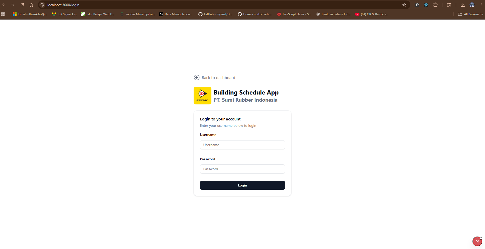
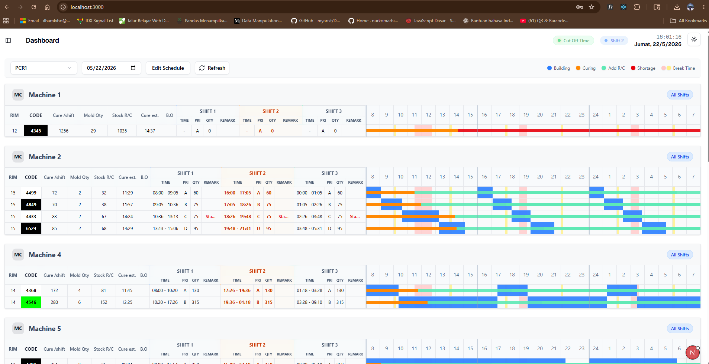
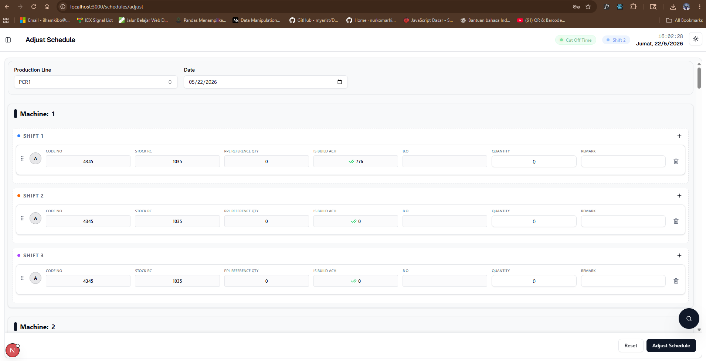

# MANUAL BOOK: SISTEM PENJADWALAN PRODUKSI (BUILDING SCHEDULE APP)

---

## 1. PENDAHULUAN
### 1.1 Latar Belakang
Sistem Building Schedule App dirancang untuk mengelola dan memantau jadwal pembuatan ban (tire building) secara real-time. Sistem ini mengintegrasikan data dari PPC (Production Planning & Control) dan PPL (Production Planning & Logistics) untuk membantu tim produksi dalam mengatur urutan kerja pada setiap mesin secara efisien.

### 1.2 Tujuan
Tujuan dari sistem ini adalah untuk menyediakan visualisasi jadwal yang jelas, memungkinkan penyesuaian jadwal yang fleksibel (drag and drop), memantau stok material, serta melacak pencapaian produksi harian secara akurat untuk meminimalkan keterlambatan.

---

## 2. OTENTIKASI DAN HAK AKSES
### 2.1 Halaman Login
Akses ke fungsi penuh sistem memerlukan otentikasi. Pengguna harus memasukkan **Username** dan **Password**. Pengguna yang belum login atau masuk sebagai tamu akan diarahkan ke mode **Viewer**.

### 2.2 Level Pengguna (Roles)
Sistem memiliki struktur hak akses sebagai berikut:

1. **Viewer (Tanpa Login / Guest):**
   * Hanya dapat melihat Dashboard dan daftar jadwal.
   * Tidak memiliki akses ke menu administrasi atau pengaturan jadwal.
2. **Editor:**
   * Memiliki akses untuk membuat dan menyesuaikan jadwal harian (Adjust Schedule).
   * Memiliki keterbatasan dalam mengubah data stok awal (Balance Out) pada beberapa modul.
   * Tidak dapat mengakses menu manajemen user.
3. **Creator:**
   * Memiliki hak akses penuh untuk membuat data master produk, mesin, dan kategori.
   * Dapat mengatur jadwal dan sinkronisasi data PPC/PPL.
4. **Admin:**
   * Level tertinggi dengan kontrol penuh atas seluruh sistem.
   * Dapat mengelola pengguna (User Management), Role, dan konfigurasi sistem global.

---

## 3. DASHBOARD UTAMA
Dashboard adalah pusat visualisasi data dan monitoring produksi real-time yang memadukan rencana kerja dan pencapaian aktual di lantai produksi.

### 3.1 Konten & Kontrol Dashboard
Halaman dashboard dilengkapi kontrol interaktif berikut:
* **Filter Bar (Bilah Filter):** 
  * **Line Selector:** Dropdown untuk memilih kategori lini produksi (misal: PCR, LTR). Daftar pilihan dimuat secara dinamis dari database.
  * **Date Picker:** Input tanggal untuk melihat jadwal hari ini, arsip kemarin, atau rencana esok hari.
  * **Edit Schedule Button:** Tombol pintasan cepat untuk masuk ke modul pengaturan jadwal. *Hanya terlihat untuk peran Admin dan Editor*.
  * **Refresh Button:** Tombol sinkronisasi manual untuk menarik data terbaru. Dilengkapi animasi ikon berputar (*spin*) saat memuat ulang data.
* **Header Informasi Mesin:** Menampilkan nomor ID mesin (*Machine Card*), shift aktif, jam mulai (*Start Time*), jam berakhir (*End Time*), sisa stok material berjalan (*Rem. Stock*), dan akumulasi total target kuantitas (*Total Qty*).

### 3.2 Detail Kolom Tabel Jadwal (Schedule Table)
Tabel ini menyajikan metrik teknis terperinci per ban yang sedang dijadwalkan:
1. **RIM:** Ukuran diameter velg ban dalam satuan inci (misal: 13, 14, 15, dst.).
2. **Code (Ukuran Ban):** Kode ukuran ban lengkap. Roda gigi visual ini diberi warna latar belakang (*Bg Color*) dan warna teks (*Text Color*) khusus yang dikonfigurasi di Master Data sehingga supervisor dapat mengidentifikasi jenis ban secara instan.
3. **Cure / Shift:** Estimasi atau kapasitas standar ban yang dapat matang (*curing*) per satu shift kerja.
4. **Mold Qty:** Jumlah cetakan (*mold*) aktif yang dipasang pada mesin curing untuk kode ban tersebut.
5. **Stock R/C (Ready Curing):** Stok ban mentah setengah jadi (*Green Tire*) yang siap dikirim ke mesin curing. Jika stok habis atau bernilai negatif di logistik, sistem secara otomatis mengunci tampilan di angka `0`.
6. **Cure Est.:** Estimasi waktu curing yang dibutuhkan untuk memenuhi target.
7. **B.O (Balance Out):** Perkiraan sisa target ban yang harus diselesaikan.
   * **Fitur Cerdas "F" (Finish):** Jika nilai B.O bernilai 10 pcs atau kurang, sistem otomatis menampilkan huruf **"F"** (*Finished*). Ini memberi tanda kepada tim produksi bahwa target ban tersebut secara praktis telah selesai, sehingga mereka bisa bersiap untuk transisi ke ukuran berikutnya.
8. **Shift 1, Shift 2, & Shift 3 (Sub-Kolom):**
   * **Time:** Slot waktu operasional pengerjaan ban di shift tersebut.
   * **Pri (Priority):** Peringkat prioritas kerja (A, B, C, dst.) yang diurutkan secara vertikal.
   * **Qty:** Target kuantitas rencana produksi ban.
   * **Remark:** Catatan penting atau instruksi khusus. Ditampilkan dalam teks merah ringkas. **Arahkan kursor (*Hover*) di atas teks Remark** untuk membuka popup tooltip eksklusif bertema merah muda yang memuat keseluruhan instruksi secara lengkap dan rapi.

### 3.3 Visualisasi Gantt Chart (Visual Timeline)
Gantt Chart di sisi kanan tabel memetakan lini masa pengerjaan produk secara grafis dan real-time:
* **Rentang Waktu 24 Jam:** Garis waktu linier membentang mulai dari pukul **08:00** pagi hari terpilih hingga pukul **08:00** pagi keesokan harinya.
* **Garis Pembatas Shift:** Garis vertikal abu-abu tebal sebagai penanda batas jam mulai/selesai antar Shift 1, 2, dan 3.
* **Visualisasi Jam Istirahat (Break Time):** Diplot otomatis pada timeline sebagai blok berwarna dengan ketentuan:
  * **Blok Merah Muda (`bg-red-200`):** Istirahat utama dengan durasi panjang (di atas 30 menit), biasanya untuk istirahat makan.
  * **Blok Kuning (`bg-yellow-200`):** Istirahat singkat (30 menit atau kurang).
  * **Jumat Istirahat Khusus (Friday Prayer Logic):** Sistem mendeteksi otomatis jika hari kerja adalah hari Jumat, dan menggeser jadwal istirahat Shift 1 agar sesuai dengan alokasi ibadah Shalat Jumat.
* **Kode Warna Lini Produksi (Phases):**
  * ■ **Biru (Building):** Durasi pengerjaan di Mesin Perakitan Ban (*Tire Building Machine*).
  * ■ **Oranye (Curing):** Estimasi waktu pematangan ban di Mesin Press Curing.
  * ■ **Hijau (Achievement / Add R/C):** Pencapaian produksi aktual yang telah berhasil dicapai secara riil.
  * ■ **Merah (Shortage):** Deteksi periode kritis di mana terjadi kekosongan material di lini produksi.
* **Tooltip Interaktif Gantt:** Saat Anda mengarahkan kursor (*hover*) ke salah satu blok fase Gantt, sistem menampilkan jendela info melayang berisi:
  * Jenis Fase (BUILDING / CURING / ACHIEVEMENT / SHORTAGE).
  * Waktu Mulai & Selesai yang presisi (Format Jam `HH:mm`).
  * Kode Ukuran Ban yang sedang diproses.

---

## 4. MODUL PENJADWALAN (SCHEDULES)

### 4.1 Adjust Schedule (Pembuatan & Modifikasi Jadwal)
Halaman ini adalah ruang kerja utama bagi **Admin** dan **Creator** untuk merancang, menggeser, dan menyelaraskan jadwal harian mesin.

#### **A. Komponen Pengendali Form**
* **Filter Seleksi Awal:** Kolom pemilihan **Line** dan **Tanggal** untuk memicu penarikan data PPC otomatis. Jika lini belum dipilih, sistem akan memblokir form dan menampilkan panduan visual.
* **Indikator Loading & Error:** Sistem dilengkapi *Skeleton Loader* yang halus saat memuat data PPC dari server serta notifikasi jika koneksi bermasalah.

#### **B. Elemen & Kolom Baris Jadwal (Card Row)**
Setiap produk di dalam mesin diwakili oleh baris kartu interaktif dengan fungsi-fungsi spesifik berikut:
1. **Grip Handle (Pegangan Drag):** Area ikon garis vertikal ganda di sisi paling kiri kartu. Klik dan tahan untuk menggeser kartu ke atas/bawah guna mengubah prioritas, atau memindahkannya ke mesin/shift lain secara bebas.
2. **Priority Badge:** Lingkaran prioritas (A, B, C, dst.) yang otomatis diurutkan kembali jika ada perubahan posisi baris.
3. **Code No (Pencarian & Seleksi Ukuran):**
   * **Data PPC:** Bersifat terkunci (*Read-Only*) untuk item bawaan rencana PPC.
   * **Data Manual (Add Item):** Berupa **Combobox** pencarian dinamis. Anda cukup mengetikkan kode ban untuk menyaring produk dari Master Data secara instan.
4. **Stock RC:** Indikator stok Ready Curing terkini dari database produk (*Read-Only*).
5. **PPL Reference Qty:** Menampilkan jumlah ketersediaan material ban berdasarkan referensi logistik terkini (*Read-Only*).
6. **Is Build Ach (Pencapaian Shift):** Menunjukkan apakah shift tersebut sudah berjalan dan menghasilkan ban aktual. Jika Ya, ditandai ikon **Centang Ganda Hijau** beserta jumlah pencapaian aktualnya. Jika Belum, ditandai ikon **Silang Merah**.
7. **B.O (Balance Out) - *Fitur Cascading & Hak Akses*:**
   * **Batasan Peran (Role Restriction):** Kolom input B.O **hanya dapat diedit** oleh Admin dan Creator. Bagi **Editor**, kolom ini dikunci (*Read-Only* berwarna abu-abu dengan kursor bertanda blokir) demi integritas data awal.
   * **Rumus Cascading Cerdas:** Ketika kuantitas target atau nilai B.O awal diubah, sistem secara otomatis menghitung ulang sisa target (*Balance Out*) secara berjenjang dari Shift 1 $\rightarrow$ Shift 2 $\rightarrow$ Shift 3. Jika suatu shift memiliki pencapaian riil (`isBuildAch` = true), pengurang B.O yang digunakan adalah `buildAchQty` (actual). Jika belum, pengurang yang digunakan adalah kuantitas rencana target (`qty`).
8. **Quantity (Target Produksi) - *Fitur Auto-Distribution*:**
   * Kolom input kuantitas rencana yang akan diproduksi.
   * **Cascading Auto-Distribution:** Jika Anda mengubah jumlah kuantitas di satu shift (misalnya Shift 1), sistem secara otomatis mendistribusikan selisih kuantitas tersebut (`-diff`) secara merata ke shift berikutnya (Shift 2 & Shift 3) pada mesin dan produk yang sama. Ini membantu menjaga konsistensi total target produksi yang direncanakan dalam satu hari tanpa perlu menghitung ulang manual.
9. **Remark:** Kolom input bebas untuk menyisipkan instruksi operasional khusus.
10. **Trash Icon (Hapus):** Tombol merah untuk menghapus item buatan manual dari daftar jadwal.

#### **C. Aksi Tambahan & Publikasi**
* **Add Item:** Tombol untuk menyisipkan satu baris kosong baru secara manual pada shift terpilih.
* **Add Machine Item (Bulk):** Tombol untuk menyisipkan baris kosong sekaligus ke tiga shift pada mesin tersebut.
* **Reset Button:** Mengembalikan seluruh kondisi form ke rencana PPC awal.
* **Adjust Schedule Button:** Melakukan validasi final dan mempublikasikan seluruh modifikasi ke Dashboard Utama dalam sekali klik.

### 4.2 Schedule List
Menyimpan arsip dokumen jadwal yang telah berhasil dipublikasikan. Memungkinkan pengguna mencari jadwal berdasarkan filter rentang tanggal dan line untuk audit atau perbandingan performa.

---

## 5. MODUL REFERENSI LOGISTIK & PERENCANAAN
Modul ini adalah penunjang utama bagi *Planner* untuk memantau sinkronisasi rantai pasok material.

### 5.1 PPC List (Production Planning & Control)
Menampilkan data rencana produksi mentah (*raw planning*) langsung dari sistem ERP PPC:
* Menyajikan detail target harian per kode ban, mesin yang dialokasikan, jumlah mold, dan shift terkait.
* Membantu memverifikasi kesesuaian data sebelum perencana melakukan penyesuaian di menu *Adjust Schedule*.

### 5.2 PPL List (Production Planning & Logistics)
Pusat informasi logistik ketersediaan bahan baku ban setengah jadi (*Ready Material*):
* **Ready Material Stock:** Menampilkan sisa stock material per ukuran ban di area logistik.
* **Status Indikator:** Memberi peringatan visual dini jika ketersediaan material berada di bawah batas aman, sehingga supervisor dapat memitigasi downtime mesin perakitan sebelum terjadi *shortage*.

---

## 6. MASTER DATA (ADMINISTRASI)
Halaman ini hanya dapat diakses oleh Admin dan Creator.

### 6.1 Products & Product Restrictions
* **Products:** Daftar semua ukuran ban beserta spesifikasi waktu siklus (cycle time).
* **Restrictions:** Mengatur pembatasan ukuran tertentu pada mesin-mesin tertentu untuk mencegah kesalahan produksi.

### 6.2 Machines & Lines
* **Machines:** Pengelolaan data fisik mesin (ID Mesin, Tipe).
* **Lines/Categories:** Pengelompokan mesin ke dalam kategori tertentu (misalnya: PCR, LTR) dan pengaturan kode ban yang diizinkan di line tersebut.

### 6.3 Shifts & Config
* **Shifts:** Pengaturan jam mulai dan selesai setiap shift, termasuk jadwal jam istirahat (break).
* **Config:** Pengaturan parameter sistem seperti batas refresh otomatis dan toleransi waktu.

### 6.4 User & Role Management
* **User List:** Menambah atau mengedit akun karyawan (NIK, Nama, Role).
* **Role List:** Mengatur nama-nama jabatan/level akses di dalam sistem.

---

## 7. PANDUAN PENGGUNAAN (WORKFLOW)
### 7.1 Alur Pembuatan Jadwal (Untuk Editor/Admin)
1. Masuk ke menu **Schedules > Adjust Schedule**.
2. Pilih **Line** dan **Tanggal**.
3. Pastikan data PPC muncul. Gunakan **Drag & Drop** untuk menyesuaikan prioritas.
4. Periksa apakah stok material (Stock RC) mencukupi.
5. Klik **"Adjust Schedule"** untuk mengirim jadwal ke Dashboard.

### 7.2 Alur Pemantauan (Untuk Viewer/Supervisor)
1. Buka **Dashboard**.
2. Pilih Line produksi yang ingin dipantau.
3. Lihat grafik **Achievement (Hijau)** untuk membandingkan dengan rencana.
4. Periksa kolom **B.O** untuk melihat sisa target yang harus diselesaikan.

---
